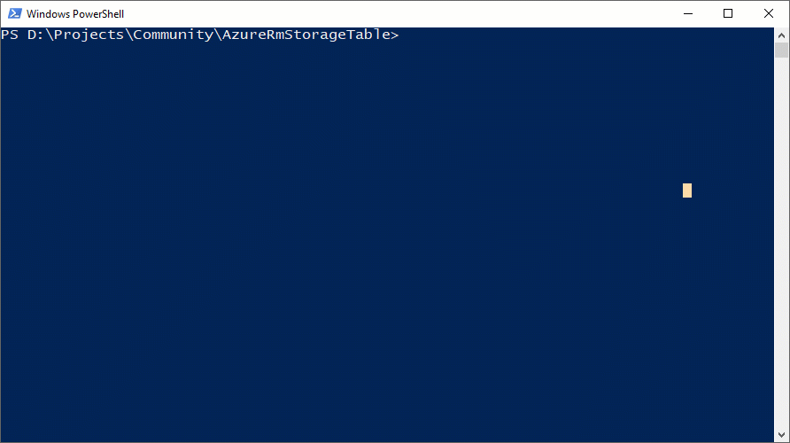

# AzureRmStorageTable
Repository for a sample module to manipulate Azure Storage Table rows/entities.

For more information, please visit the following blog post:
https://blogs.technet.microsoft.com/paulomarques/2017/01/17/working-with-azure-storage-tables-from-powershell/

This module supports *Azure Storage Tables*. Cosmos DB support was removed and it will have its own module. 

## Quick Setup
1. In a Windows 10/2016 execute the following cmdlets in order to install required modules
    ```powershell
    Install-Module Az.Resources -AllowClobber -Force
    Install-Module Az.Storage -AllowClobber -Force
    ```
    
1. Install AzureRmStorageTable
    ```powershell
    Install-Module AzureRmStorageTable
    ```

Below you will get the help content of every function that is exposed through the AzureRmStorageTable module:

[Add-AzTableRow](docs/Add-AzTableRow.md)
[Get-AzTableRow](docs/Get-AzTableRow.md)
[Get-AzTableRowAll](docs/Get-AzTableRowAll.md)
[Get-AzTableRowByColumnName](docs/Get-AzTableRowByColumnName.md)
[Get-AzTableRowByCustomFilter](docs/Get-AzTableRowByCustomFilter.md)
[Get-AzTableRowByPartitionKey](docs/Get-AzTableRowByPartitionKey.md)
[Get-AzTableRowByPartitionKeyRowKey](docs/Get-AzTableRowByPartitionKeyRowKey.md)
[Get-AzTableTable](docs/Get-AzTableTable.md)
[Remove-AzTableRow](docs/Remove-AzTableRow.md)
[Update-AzTableRow](docs/Update-AzTableRow.md)

# Running automated tests

## Prerequisites

* [Pester](https://github.com/pester/Pester) - PowerShell BDD style testing framework
* [Azure Storage Emulator](https://docs.microsoft.com/en-us/azure/storage/storage-use-emulator) or [Azure Subscription](https://azure.microsoft.com/en-us/free/)
* [Azure Power Shell](https://docs.microsoft.com/en-us/powershell/azure/overview)

## How to run automated tests

### Before you run

Please make sure that your Azure Storage Emulator is up and running if you want to run all tests against it.

### Run

```
PS> Invoke-Pester
```


