# Working with Azure Tables from PowerShell - AzureRmStorageTable/AzTable PS Module v2.0

This document shows how to work with Azure Storage Tables from PowerShell, through a sample PowerShell module that was created for operations like Add, Retrieve, Update and Delete table rows/entities exposed as functions. Now supporting the new Az PowerShell module plus the SDK change from Microsoft.WindowsAzure.Storage to Microsoft.Azure.Cosmos assembly.

## In this document

* [Updates](#updates)
* [Introduction](#intro)
* [Requirements](#requirements)
* [Installation/Source Code](#install)
* [Using Azure Storage Table PowerShell Module](#psstoragetable)
  * [Adding Rows/Entities](#adding)
  * [Retrieving Rows/Entities](#retrieving)
  * [Updating an entity](#updating)
  * [Deleting rows/entities](#deleting)
* [Azure Automation](#azureautomation)
* [Troubleshooting](#troubleshooting)
* [References](#references)

## Updates<a name="updates"></a>

**Update 08/06/2019**: Comments were removed from the original blog post due to efforts to centralize discussions and/or issues into the module repo due to this module ownership changes. If you have any issues/comments, please file a comment/issue [here](https://github.com/paulomarquesc/AzureRmStorageTable/issues).

**Update 04/04/2019**: To avoid confusion if this module supports the new Az Powershell module, a new module name was released in the PowerShell Gallery under the name **AzTable**. The old name, **AzureRmStorageTable** will be kept in the gallery for compatibility purposes, both references the same code. This document will reference the new module name only.

**Update 03/26/2019**: Updates to use the new Az.Storage PowerShell module, which is now the requirement for this module to work since the old Microsoft.WindowsAzure.Storage assembly got replaced by Microsoft.Azure.Cosmos. It also runs on PowerShell core as well, tested on PS 5.1, PS 6.2 and Linux PS. Kudos to [jakedenyer](https://github.com/jakedenyer) for his contributions on async methods.

**Update 03/08/2018**: Due to a number of conflicts related to assemblies needed on Storage Tables and Cosmos DB, as of this date, Cosmos DB support was removed from this module and I'll be working in a separate module for Cosmos DB and this will be release shortly.

**Update 12/04/2017**: Due to a large number of customers that have applications that adds a Timestamp entity attribute to the tables, the default Azure Table system attribute called Timestamp got renamed to TableTimeStamp so customers can consume their application’s own Timestamp value and avoid conflicts, this might be a breaking change but it is a necessary change. This change is implemented on version 1.0.0.21.

**Update 05/22/2017**: Since module version 1.0.0.10 it was added a cmdlet (Get-AzureStorageTableTable) and support for Azure Cosmos DB Tables, for more information please refer to Azure RM Storage Tables PowerShell module now includes support for Cosmos DB Tables blog post.

**Release Notes**: For more details about updates being done in the module, please refer to its release notes on [GitHub](https://github.com/paulomarquesc/AzureRmStorageTable/blob/master/ReleaseNotes.md).

## Introduction<a name="intro"></a>
Azure Storage Tables is one of the four Microsoft Azure Storage abstractions available (Blobs, Queues and Azure Files are the other ones) at the time that this blog was written. It is basically a way to store data in a structured way on a non relational database system (meaning, not an RDBMS system) based on key-value pairs.

Since up to today there are no official cmdlets to support entity/row management inside the tables from Azure PowerShell module, I decided to create this simple module to help IT Pros to leverage this service without having knowledge of .NET framework through some simple cmdlets as follows:

| **Cmdlet**                         | **Description**                                                                                              |
| ---------------------------------- | ------------------------------------------------------------------------------------------------------------ |
| Add-AzTableRow                     | Adds a row/entity to a specified table                                                                       |
| Get-AzTableRow                     | Used to return entities from a table with several options, this replaces all other Get-AzTable<XYZ> cmdlets. |
| Get-AzTableRowAll                  | (Deprecated) Returns all rows/entities from a storage table - no Filtering                                   |
| Get-AzTableRowByColumnName         | (Deprecated) Returns one or more rows/entities based on a specified column and its value                     |
| Get-AzTableRowByCustomFilter       | (Deprecated) Returns one or more rows/entities based on custom Filter                                                     |
| Get-AzTableRowByPartitionKey       | (Deprecated) Returns one or more rows/entities based on Partition Key                                                     |
| Get-AzTableRowByPartitionKeyRowKey | (Deprecated) Returns one entity based on Partition Key and RowKey                                                         |
| Get-AzTableTable                   | Gets a Table object to be used in all other cmdlets                                                          |
| Remove-AzTableRow                  | Removes a specified table row                                                                                |
| Update-AzTableRow                  | Updates a table entity                                                                                       |

> Note: For compatibility purposes, aliases were created for the old noun style `AzureStorageTable`. New noun, `AzTable`, is the replacement that will allow you to automatically load the `AzTable`. If you wish to continue to use the old names, make sure you explicitly load the module before using them.

There are a number of use cases for an IT Pro work with Azure Tables from PowerShell where it becomes a great repository, the ones below are just few examples:

* Logging for SCCM executed scripts
* Azure Automation for VM expiration, shutdown, startup in classic mode (Azure Service Manager)
* VM Deployment scripts, where it becomes a central location for logs
* Easily extract Performance and Diagnostics data from VMs with Diagnostics enabled

## Requirements<a name="requirements"></a>
PowerShell 5.1 or greater (this is also supported on Linux PowerShell)
This module requires the new [Az Modules](https://docs.microsoft.com/en-us/powershell/azure/new-azureps-module-az?view=azps-1.5.0):
* Az.Storage (1.1.0 or greater)
* Az.Resources (1.2.0 or greater)

You can get this information by issuing the following command line from PowerShell:

```powershell
Get-Module -Name "az*" -ListAvailable
```
 
## Installation/Source Code<a name="install"></a>
Since this module is published on [PowerShell Gallery](https://www.powershellgallery.com/packages/AzTable), you can install this module directly from PowerShell 5.1 or greater and Windows 10 / Windows Server 2016 / Linux by executing the following cmdlet in an elevated (Windows) PowerShell command prompt window:

```powershell
# Note: Please use one of the options below, not both, they install the same
# cmdlets but the first method gives you the new module name, the old one
# is being kept for compatibility purposes

# RECOMMENDED: Installing the module under its new name
Install-Module AzTable

# If you want to keep installing through the old name
Install-Module AzureRmStorageTable
```
 
As an alternative, you can manually download the module from my GitHub repository [here](https://github.com/paulomarquesc/AzureRmStorageTable) and extract to `C:\Program Files\WindowsPowerShell\Modules` for PowerShell 5.1 or  `C:\Program Files\PowerShell\Modules` for PowerShell 6.2 , or greater, and rename the folder to AzureRmStorageTable. Please remember to **unblock** the zip file before extracting it.

## Using Azure Storage Table PowerShell Module<a name="psstoragetable"></a>
The following steps will walk you through loading the module and perform one or more example tasks of the basic operations offered in this module.

Before you start working with it, you need to authenticate to Azure and select the correct subscription if you have multiple subscriptions:

```powershell
Add-AzAccount
Select-AzSubscription -Subscription `<your subscription name>`
```

Next, lets import `AzTable` PowerShell module and list the functions available on it:

```powershell
# If you are still using the old module name, please replace line below with Import-Module AzureRmStorageTable
Import-Module AzTable
Get-Command -Module AzureRmStorageTable -CommandType Function
```

You should see the following cmdlets:

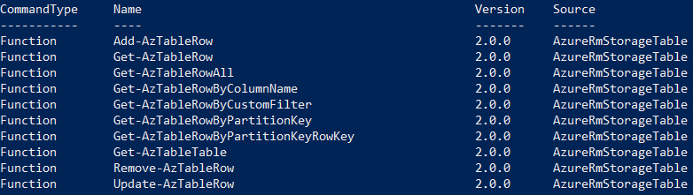

For the sake of simplicity, we need to define some variables at this point to make our examples a little bit more clean, please, **make sure you have an storage account already created and that you change the values of the variables below to reflect your environment**. Notice that one of the variables is called **$partitionKey**, in this example we are using only one partition, please refer to the documentation at the end of this blog in order to get a better understanding on partitions.

```powershell
$resourceGroup = "Support-rg"
$storageAccount = "pmcstorage07"
$tableName = "mytable01"
$partitionKey = "LondonSite"
```

Get a reference for your table with the following cmdlet:

```powershell
$table = Get-AzTableTable -resourceGroup $resourceGroup -TableName $tableName -storageAccountName $storageAccount
```

You can check details of your table by executing typing `$table`:

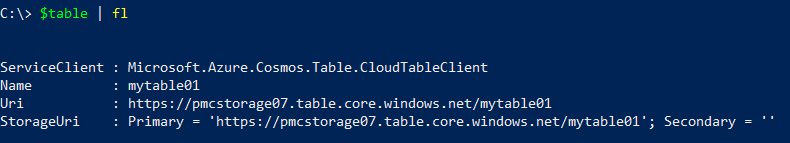

Optionally, you can obtain the table reference by using the Az.Storage cmdlets:

```powershell
$SaContext = (Get-AzStorageAccount -ResourceGroupName $resourceGroup -Name $storageAccount).Context
$table = (Get-AzStorageTable -Name $tableName -Context $saContext).CloudTable
```

> Note: With release of Az.Storage 1.1.0, you need to reference the CloudTable property of the table returned from Get-AzStorageTable, that was not needed in the previous versions, ideally you will use Get-AzTableTable cmdlet instead but there might be cases where you need the Get-AzStorageTable.

Up to this point we just prepared our PowerShell session by authenticating, importing the module, setting up some variables and getting our table, from this point moving forward we will focus on the basic operations exposed through the module. I’m creating a section per function/operation.

### Adding Rows/Entities<a name="adding"></a>
#### Adding lines one by one

```powershell
Add-AzTableRow -table $table -partitionKey $partitionKey -rowKey ([guid]::NewGuid().tostring()) -property @{"computerName"="COMP01";"osVersion"="Windows 10";"status"="OK"}
Add-AzTableRow -table $table -partitionKey $partitionKey -rowKey ([guid]::NewGuid().tostring()) -property @{"computerName"="COMP02";"osVersion"="Windows 8.1";"status"="NeedsOsUpgrade"}
Add-AzTableRow -table $table -partitionKey $partitionKey -rowKey ([guid]::NewGuid().tostring()) -property @{"computerName"="COMP03";"osVersion"="Windows XP";"status"="NeedsOsUpgrade"}
```

Result, notice the 204 HttpsStatusCode, indicating that your operation succeeded.

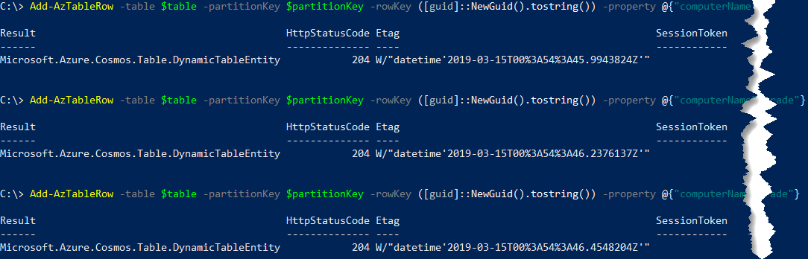

#### Getting data from a JSON string and using a foreach loop to load the data

```powershell
$computerList = '[{"computerName":"COMP04","osVersion":"Windows 7","status":"OK"},{"computerName":"COMP05","osVersion":"Windows 8","status":"OK"},{"computerName":"COMP06","osVersion":"Windows XP","status":"NeedsOsUpgrade"},{"computerName":"COMP07","osVersion":"Windows NT 4","status":"NeedsOsUpgrade"}]'
$newPartitionKey = "NewYorkSite"
foreach ($computer in ($computerList | ConvertFrom-Json) )
{
    Add-AzTableRow -table $table `
        -partitionKey $newPartitionKey `
        -rowKey ([guid]::NewGuid().tostring()) `
        -property @{"computerName"=$computer.computerName;"osVersion"=$computer.osVersion;"status"=$computer.status}
}
```

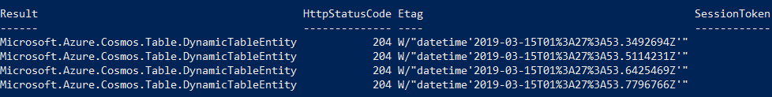

If we open [Azure Storage Explorer](https://azure.microsoft.com/en-us/features/storage-explorer/) and navigate to the table, we will see all inserted entities.

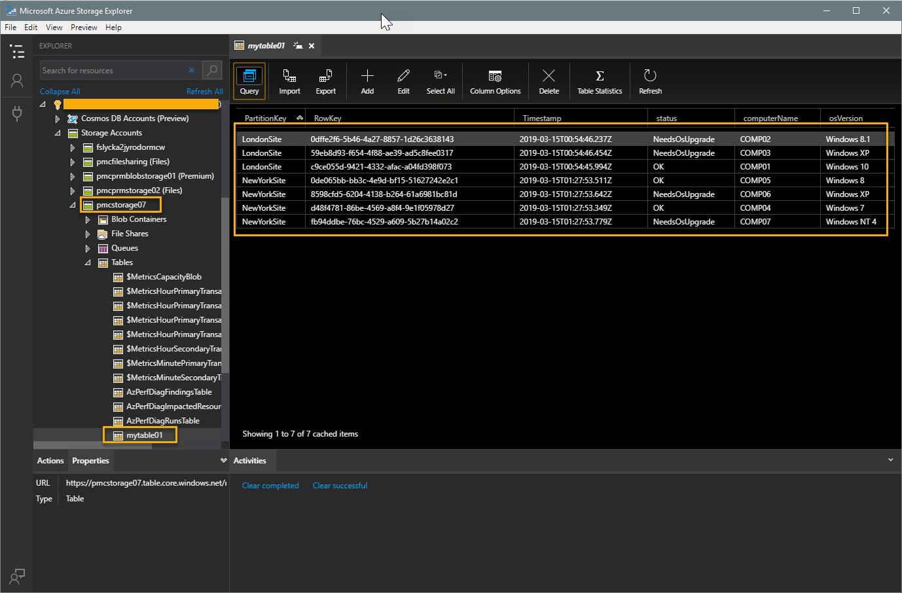

### Retrieving Rows/Entities<a name="retrieving"></a>

When retrieving rows using the functions described below, they will return a **PSObject** instead of a **DynamicTableEntity** and since they will give you some extra work to manipulate/access the properties I decided to make the Get cmdlets return PSObject instead.

Example a DynamicTableEntity object:
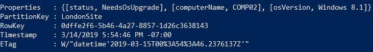

Example of PSObject when it is returned from the functions exposed in this module:
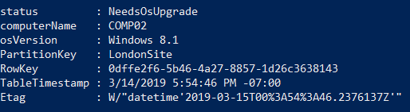

> Note: when working with custom queries, the properties to be used are the ones that are shown in the DynamicTableEntity. If you're bringing more rows and then will be using PowerShell features for filtering (e.g. Where-Object), then you must refer to the PSObject properties instead. 

#### Retrieving all rows/entities

```powershell
Get-AzTableRow -Table $table | ft
```

Result

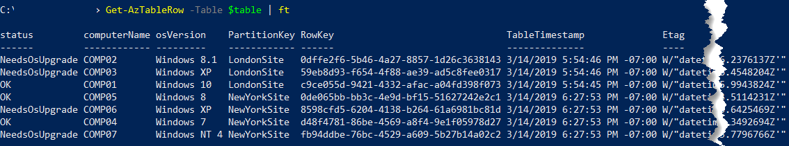

#### Getting rows/entities by partition key

```powershell
Get-AzTableRow -table $table –partitionKey “LondonSite” | ft
```

Result

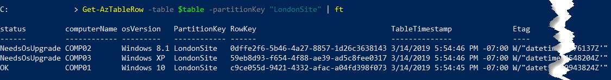

#### Getting rows/entities by specific column

```powershell
Get-AzTableRow -table $table -columnName "computerName" -value "COMP01" -operator Equal
```

Result

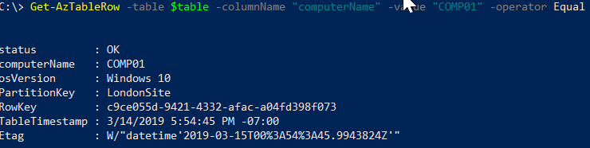

Example using a guid entity type:

```powershell
# Creating a guid object
$guid = [guid]::NewGuid()

# Adding a sample row
Add-AzTableRow -table $table -partitionKey "partition01" -rowKey "item1" -property @{"id"=$guid;"computerName"="COMP01";"osVersion"="Windows 10";"status"="OK"}

# Getting row based on guid value of Id column using the $guid object
Get-AzTableRow -table $table -columnName id -guidValue $guid -operator Equal

# Getting row based on guid value of Id column by casting a guid string into guid type
Get-AzTableRow -table $table -columnName id -guidValue ([guid]"30cd1759-45b3-4ead-8767-ebeef6c0d206") -operator Equal
```

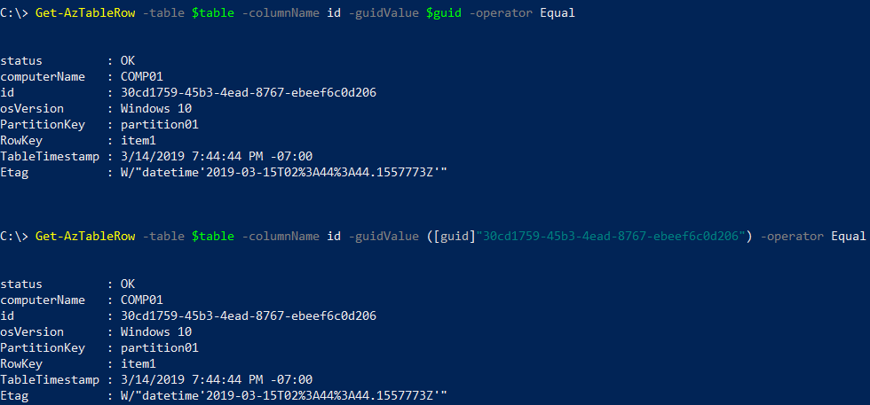

#### Queries using custom filters with help of Microsoft.Azure.Cosmos.Table.TableQuery class and direct string text

The custom filter is an important option since we are not covering all data types from the module, for example datetime types.

>Note: When working with logical operators (and, or, not), they are case-sensitive and must be used as lower case since the underlying SDK uses OData v3 specification. [Here](http://docs.oasis-open.org/odata/odata/v4.01/odata-v4.01-part2-url-conventions.html#sec_LogicalOperators) you can find more information.  

##### Simple filter

```powershell
[string]$filter1 = [Microsoft.Azure.Cosmos.Table.TableQuery]::GenerateFilterCondition("computerName",[Microsoft.Azure.Cosmos.Table.QueryComparisons]::Equal,"COMP06")
Get-AzTableRow -table $table -customFilter $filter1
```

Result

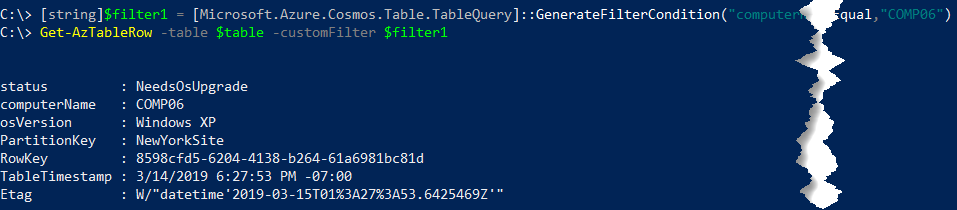

##### Combined filter

```powershell
[string]$filter1 = [Microsoft.Azure.Cosmos.Table.TableQuery]::GenerateFilterCondition("computerName",[Microsoft.Azure.Cosmos.Table.QueryComparisons]::Equal,"COMP03")
[string]$filter2 = [Microsoft.Azure.Cosmos.Table.TableQuery]::GenerateFilterCondition("status",[Microsoft.Azure.Cosmos.Table.QueryComparisons]::Equal,"NeedsOsUpgrade")
[string]$finalFilter = [Microsoft.Azure.Cosmos.Table.TableQuery]::CombineFilters($filter1,"and",$filter2)
Get-AzTableRow -table $table -customFilter $finalFilter
```

Result

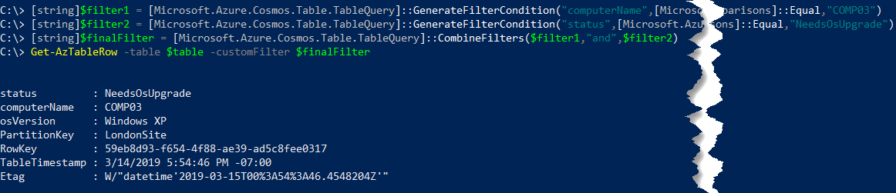

##### String filter

```powershell
Get-AzTableRow -table $table -customFilter "(computerName eq 'COMP07') and (status eq 'NeedsOsUpgrade')"
```

Result

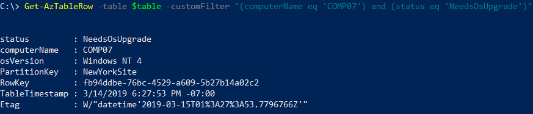

### Updating an entity<a name="updating"></a>

This process requires three steps:

* Retrieve the row/entity to update
* Perform the change on this retrieved item
* Commit the change

> Note: **Update-AzTableRow** function will accept one entry at a time, don’t pass an array of entities or pipe an array of entities to the function.

Example:

```powershell
# Creating the filter and getting original entity
[string]$filter = [Microsoft.Azure.Cosmos.Table.TableQuery]::GenerateFilterCondition("computerName ",[Microsoft.Azure.Cosmos.Table.QueryComparisons]::Equal,"COMP03")
$computer = Get-AzTableRow -table $table -customFilter $filter

# Changing values
$computer.osVersion = "Windows 10"
$computer.status = "OK"

# Updating the content
$computer | Update-AzTableRow -table $table

# Getting the entity again to check the changes
Get-AzTableRow -table $table -customFilter $filter
```

Result

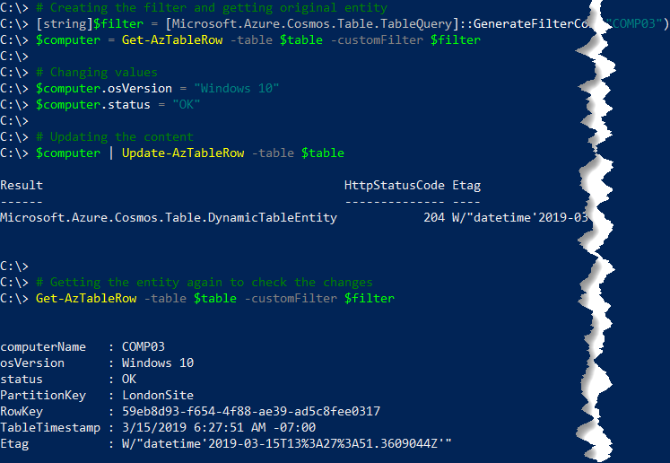

### Deleting rows/entities<a name="deleting"></a>

Similarly to the update process here we have two steps as follows unless you know the partitionKey and rowKey properties, in this case you can delete directly:

1. Retrieve the entity
2. Delete the entity passing the retrieved one as argument

#### Deleting a single row/entity by piping the entity

```powershell
[string]$filter1 = [Microsoft.Azure.Cosmos.Table.TableQuery]::GenerateFilterCondition("computerName",[Microsoft.Azure.Cosmos.Table.QueryComparisons]::Equal,"COMP02")
$computerToDelete = Get-AzTableRow -table $table -customFilter $filter1

$computerToDelete | Remove-AzTableRow -table $table

Get-AzTableRow -table $table -customFilter $filter1 # does not return the entity anymore
```

Result

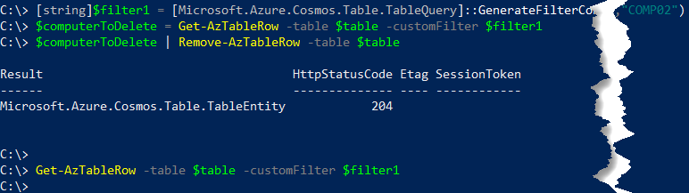

#### Deleting a single row/entity passing entity as argument

```powershell
[string]$filter1 = [Microsoft.Azure.Cosmos.Table.TableQuery]::GenerateFilterCondition("computerName",[Microsoft.Azure.Cosmos.Table.QueryComparisons]::Equal,"COMP06")
$computerToDelete = Get-AzTableRow -table $table -customFilter $filter1

Remove-AzTableRow -table $table –entity $computerToDelete

Get-AzTableRow -table $table -customFilter $filter1 # does not retrieve the entity anymore
```

Result

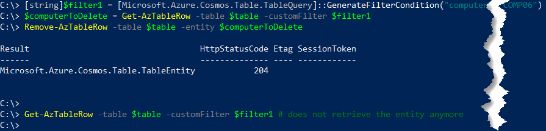

#### Deleting an entry by using PartitionKey and RowKey directly

```powershell
# Adding a sample row
Add-AzTableRow -table $table -partitionKey "PartitionTest-12345" -rowKey "MyItemToBeDeleted" -property @{"computerName"="COMP99";"osVersion"="Windows 10";"status"="OK"}

# Showing the new entity
Get-AzTableRow -table $table –partitionKey "PartitionTest-12345" | ft

# Deleting based on partition and row keys
Remove-AzTableRow -table $table -partitionKey "PartitionTest-12345" -rowKey "MyItemToBeDeleted"

Get-AzTableRow -table $table –partitionKey "PartitionTest-12345" | ft # Nothing returned
```

Result

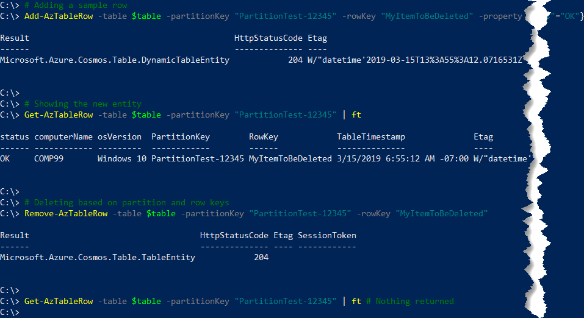

#### Deleting everything

```powershell
Get-AzTableRow -table $table | Remove-AzTableRow -table $table
```

## Azure Automation<a name="azureautomation"></a>

In order to run this module from within Azure Automation Runbooks, please make sure you follow the steps outlined at [Az module support in Azure Automation](https://docs.microsoft.com/en-us/azure/automation/az-modules).

## Troubleshooting<a name="troubleshooting"></a>

This section helps you troubleshoot some of the most common issues:

* **Method invocation failed because [Microsoft.WindowsAzure.Commands.Common.Storage.ResourceModel.AzureStorageTable] does not contain a method named 'ExecuteQuerySegmentedAsync'**.
    
    Please refer to [this](https://github.com/paulomarquesc/AzureRmStorageTable/issues/30) issue discussion on Github repo.

* **New-Object : Cannot find type [Microsoft.Azure.Cosmos.Table.TableQuery]: verify that the assembly containing this type is loaded.At C:\Program Files\WindowsPowerShell\Modules\AzureRmStorageTable\2.0.1\AzureRmStorageTableCoreHelper.psm1**
    
    Make sure you have Az.Storage (1.1.0 or greater) installed, be aware that in case of duplicated modules installed you also may have the same issue, [this](https://github.com/paulomarquesc/AzureRmStorageTable/issues/30) discussion highlight another way this may happen and how to fix it (solution 2 that I presented).

* **The term 'Update-AzureStorageTableRow' is not recognized as the name of a cmdlet, function, script file, or operable program. Check the spelling of the name, or if a path was included, verify that the path is correct and try again.**
    
    This error can happen with with other cmdlets as well, e.g. Get-AzureStorageTableTable, this happens because all cmdlets got renamed as previously mentioned in this article, aliases were created to keep compatibility but you need to perform an `Import-Module AzureRmStorageTable` or `Import-Module AzTable` in order to load the aliases since the module auto-load only happens for the cmdlets itself and not the aliases. I strongly advise that you rename your cmdlets as soon as possible to avoid future issues.

## References<a name="references"></a>

For more information about Azure Storage Tables, please refer to the following documents:

* [Perform Azure Table storage operations with Azure PowerShell](https://docs.microsoft.com/en-us/azure/storage/tables/table-storage-how-to-use-powershell)
* [Get started with Azure Table storage using .NET](https://docs.microsoft.com/en-us/azure/storage/storage-dotnet-how-to-use-tables)
* [Azure Storage Client Library for .NET](https://msdn.microsoft.com/library/azure/mt347887.aspx)
* [Getting Started with Azure Table Storage in .NET](https://azure.microsoft.com/en-us/resources/samples/storage-table-dotnet-getting-started/)
* [Azure Storage Table Design Guide: Designing Scalable and Performant Tables](https://docs.microsoft.com/en-us/azure/storage/storage-table-design-guide)

